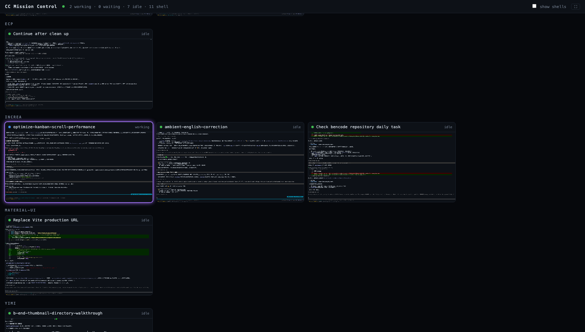

# CC Mission Control

A mission-control dashboard for [Claude Code](https://claude.com/claude-code) sessions running in [WezTerm](https://wezterm.org).

When you run a dozen Claude Code sessions across WezTerm workspaces and tabs, you lose track of who is working, who is stuck waiting for your approval, and who has been idle for an hour. This tool gives you the movie-style control-room wall: every session as a live, full-color terminal thumbnail, grouped by workspace, with status at a glance.




> Live capture of a real session wall, grouped by workspace. The violet ring marks the pane currently focused in WezTerm; waiting sessions pulse amber with an Approve button right on the tile.

## Features

- **Live terminal thumbnails** — each pane rendered by xterm.js from WezTerm's ANSI screen dump, scaled down. What you see is exactly what the terminal shows, in color.
- **Status detection, zero config** — Claude Code already encodes its state in the pane title it sets (braille spinner = working, `✳` = idle). Permission dialogs and plan approvals are detected from the visible screen, shown as `waiting` with an amber pulse.
- **Click to zoom** — click a tile to open the session near full size in a lightbox (live-updating), so you can read exactly what is on screen before acting. Jump to the pane in WezTerm from there, or press Escape to go back to the wall.
- **Quick approve, with eyes open** — sessions blocked on a permission prompt show `✓ Approve` / `✗ Esc` buttons on both the tile and the zoom view: glance at the title for routine prompts, or zoom in to read the full dialog before approving.
- **Workspace grouping & summary** — tiles grouped by WezTerm workspace; the top bar counts `working · waiting · idle · shell`, and the page title flags waiting sessions for your browser tab.

## Requirements

- WezTerm (tested with `20240203-110809`) — the dashboard talks to `wezterm cli`
- Node.js ≥ 22, pnpm
- macOS for the bring-to-front behavior (everything else is cross-platform)

## Usage

```sh
pnpm install
pnpm dev          # builds the client and starts the server
open http://localhost:6080
```

Environment variables:

| Variable | Default | Purpose |
|---|---|---|
| `PORT` | `6080` | HTTP port |
| `POLL_INTERVAL_MS` | `1000` | Screen capture interval |
| `WEZTERM_BIN` | auto-detected | Path to the `wezterm` binary |

## Cross-workspace focus (optional, recommended)

`wezterm cli activate-pane` can only switch tabs within the active workspace — it cannot
switch the GUI to another workspace. To make "Open in WezTerm" work across workspaces,
load the bundled Lua bridge in your `wezterm.lua` (before `return config`):

```lua
dofile('/path/to/cc-mission-control/integrations/wezterm-focus.lua')
```

The dashboard writes focus requests to `~/.cache/cc-mission-control/focus-request`; the
bridge picks them up on the next status tick (≤1s) and performs the full
workspace + tab + pane jump from inside the GUI, where `SwitchToWorkspace` is available.
Without the bridge, focus still works within the current workspace.

## How it works

```
wezterm cli list ──┐
wezterm cli get-text --escapes ──┤  poller (1s tick, per-pane content hash,
                                 │          runs only while a client is connected)
                                 ▼
                       node:http server ── SSE ──▶ browser
                                 ▲                  └─ one xterm.js instance per pane,
   POST /api/focus ── activate-pane                    created at the pane's real cols×rows,
   POST /api/send ──── send-text                       scaled down with CSS transform
```

- `src/wezterm.ts` — thin wrappers around `wezterm cli` (the only WezTerm-specific code; a tmux adapter would slot in here)
- `src/status.ts` — pure functions mapping pane title + screen text to `working | waiting | idle | shell`
- `src/poller.ts` — polling loop, emits only panes whose content changed
- `src/server.ts` — SSE stream, focus/send actions, static files
- `src/client/` — tile grid, xterm rendering, workspace grouping

## Development

```sh
pnpm test         # status detection unit tests (real captured fixtures)
pnpm typecheck
```

## Limitations

- Only sees Claude Code sessions running inside WezTerm panes (not VS Code, web, or other terminals).
- "Open in WezTerm" across workspaces requires the Lua bridge above; the WezTerm CLI alone cannot switch workspaces.
- Status detection is heuristic — it parses what is on screen. New Claude Code UI wording may need a pattern update in `src/status.ts`.
- The approve button sends the keystroke `1`, which selects "Yes" in current permission dialogs.

## License

MIT
