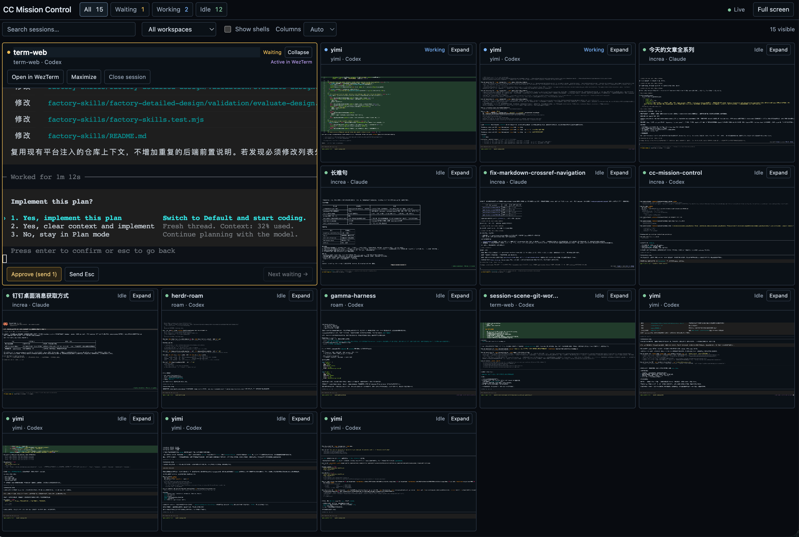

# CC Mission Control

Monitor and control [Claude Code](https://claude.com/claude-code) and Codex sessions running in [WezTerm](https://wezterm.org) from one live terminal dashboard.

See which agents are working or waiting for input, expand a session to read its output, and switch to its terminal when you need to act. Claude Code and Codex sessions can share the same wall; ordinary shell panes are optional.




The live terminal wall keeps other agents visible while one session expands in place for reading. Search, workspace and status filters help you find the next session to inspect.

## Features

- **Claude Code and Codex** — identify both agents from attached processes and terminal titles, and estimate their working, waiting, or idle state from titles and visible output. Each card shows its agent and workspace.
- **Continuous terminal wall** — sessions fill one grid, ordered by waiting, working, idle, then shell; workspace labels stay inside the cards. Auto columns adapt to the window, up to five columns. On a 1536×1024 desktop, the compact layout fits 20 normal cards.
- **Search and filters** — combine title/workspace/directory search, a workspace selector, and status filters. Shell sessions are hidden by default. Filters change only the displayed cards.
- **Expand in place** — click a card to move it to the start of its row and expand it across two columns and two rows. Other terminals keep updating. Status changes do not reorder cards during reading; collapse restores the normal order. On a single-column screen, expansion uses one column.
- **Readable output** — small previews fit the entire terminal screen. Expanded cards use 14px text and native scrolling, following the bottom until you scroll away. Maximize opens a larger reading view; Back or Escape returns to the expanded card.
- **Explicit actions** — Open in WezTerm switches to the session through the Lua focus bridge. Approve (send 1) sends the literal key `1`; Send Esc sends Escape. Close session terminates the WezTerm pane and everything running in it, with two clicks required within three seconds. Action controls appear in the expanded and maximized views.
- **Next waiting** — cycles through waiting sessions in the current filters. New waiting sessions do not take over the reading view. A session stays expanded while it matches the current filters.
- **Focus and connection indicators** — Active in WezTerm identifies the actual terminal focus independently of the expanded card. The overview scrolls to a newly focused pane; an expanded reading view stays in place. Reconnecting indicates potentially stale screens.

### Keyboard and display controls

Tab to a card title and press Enter or Space to expand/collapse it. Escape closes the maximized view first, then collapses the in-grid view; it does not send Escape to WezTerm. The column selector retains each browser's preference, with narrow windows limiting the actual number of columns. Full screen uses the browser's fullscreen mode.

The dashboard monitors sessions you start in WezTerm. Terminal previews are read-only; use Open in WezTerm for typing and interacting with the agent. The dashboard does not start agents, coordinate their tasks, or approve prompts automatically.

## Requirements

- WezTerm (tested with `20240203-110809`) — the dashboard talks to `wezterm cli`
- Node.js ≥ 22, pnpm
- Process-based agent detection uses `ps -axo pid=,pgid=,tty=,comm=`.
- Bringing the WezTerm application window to the foreground is implemented only on macOS. Other platforms require separate validation.

## Usage

```sh
pnpm install
pnpm dev          # builds the client and starts the server
open http://localhost:6080
```

Environment variables:

| Variable | Default | Purpose |
|---|---|---|
| `PORT` | `6080` | HTTP port |
| `POLL_INTERVAL_MS` | `1000` | Screen capture interval |
| `WEZTERM_BIN` | auto-detected | Path to the `wezterm` binary |

## Open in WezTerm setup

Viewing the terminal wall does not require the Lua bridge. The **Open in WezTerm** button
requires it to switch the GUI workspace, tab, and pane for either Claude Code or Codex.
Load the bundled bridge in your `wezterm.lua` before `return config`:

```lua
local focus_bridge = '/path/to/cc-mission-control/integrations/wezterm-focus.lua'
wezterm.add_to_config_reload_watch_list(focus_bridge)
dofile(focus_bridge)
```

After installing the bridge, reload the WezTerm configuration or restart WezTerm once.
The bridge then watches its own file, so later updates reload automatically. The
dashboard writes short-lived focus requests to
`~/.cache/cc-mission-control/focus-request`; the bridge checks for the latest request
every `200ms`. Expired requests are discarded, so a delayed bridge
cannot unexpectedly execute an old click.

The bridge timer is independent of `status_update_interval`; with no request file each
tick is only one failing `io.open`.

## How it works

```
wezterm cli list/get-text ── screen poll (1s, sequential capture) ──┐
wezterm cli list-clients ─── focus poll (250ms) ───────────────────┤
                                                                   ▼
                                                        node:http server ── SSE ──▶ browser
                                                                   ▲
POST /api/focus ── expiring mailbox ── Lua focus bridge ──────────┘
POST /api/send ─── wezterm cli send-text
POST /api/close ── wezterm cli kill-pane
```

- `src/wezterm.ts` — WezTerm CLI access and focus-bridge requests
- `src/processes.ts` — identifies Claude Code and Codex processes by terminal TTY
- `src/status.ts` — identifies agents and derives `working | waiting | idle | shell` from process signals, pane titles, and screen text
- `src/poller.ts` — independent screen and focus polling, emits only changed panes
- `src/server.ts` — SSE stream, focus/send actions, static files
- `src/client/` — continuous tile grid, filtering, in-grid expansion, and xterm reading views

## Development

```sh
pnpm test         # agent/status detection, focus format, screen writer, and UI helpers
pnpm typecheck
```

## Limitations

- Agent recognition supports Claude Code and Codex running in WezTerm panes. Other panes can be shown as shells; sessions outside WezTerm are not monitored.
- Open in WezTerm requires the Lua bridge above; the WezTerm CLI alone cannot switch workspaces consistently.
- Status detection is heuristic, using attached processes, pane titles, and visible-screen patterns. Idle does not mean a task succeeded or finished. New Claude Code or Codex UI wording may need a pattern update in `src/status.ts`.
- Approve (send 1) sends the literal keystroke `1`. Read the current prompt before acting; waiting status detection is heuristic.

## License

MIT
